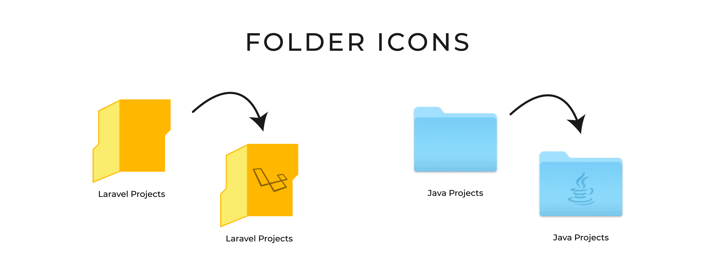
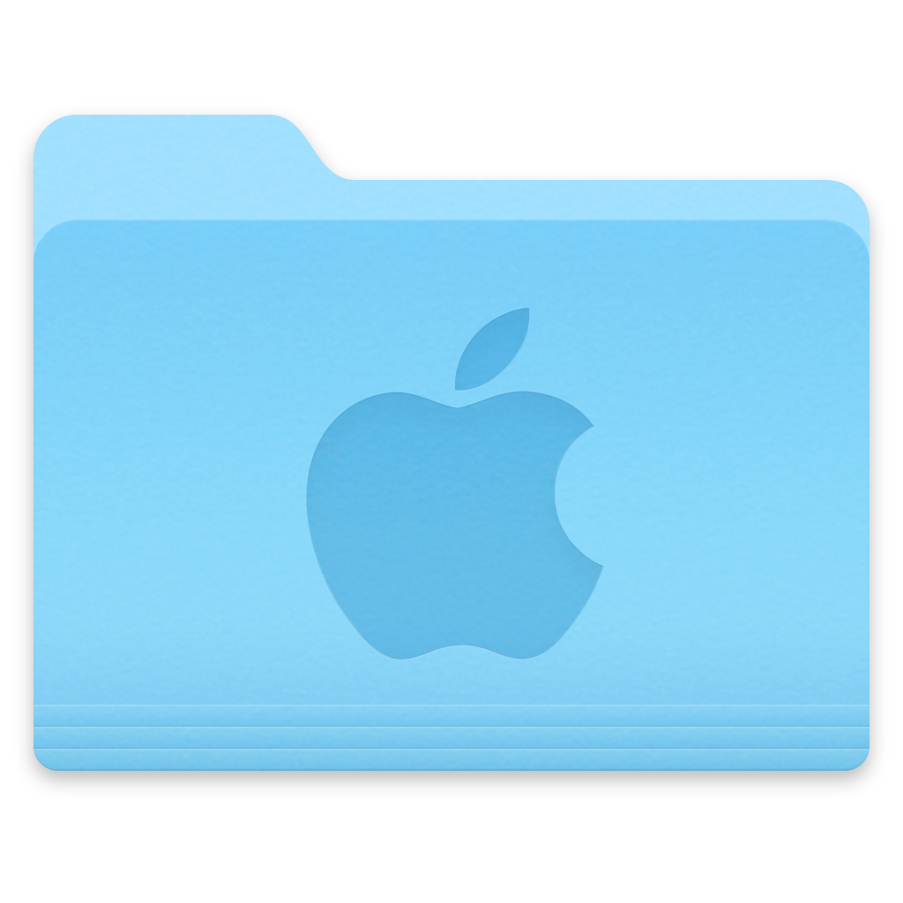
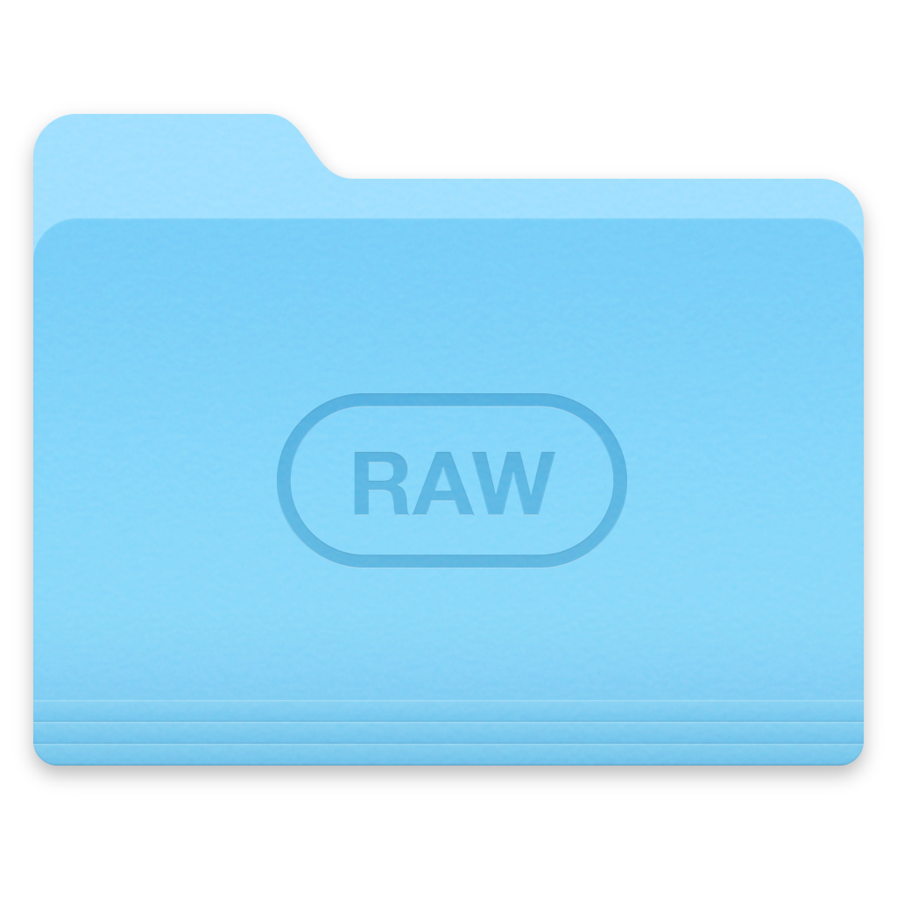

## About Folder Icons

Folder Icons is a pack of custom icons for folders. We believe that organized people are more productive. Custom folder icons can help to be more organized by replacing simple folders with custom ones. It visually helps to find needed folder faster by focusing on the icon of the folder. [Click here](https://vigokrumins.github.io/folder-icons) to visit website.

## Usage

**macOS:**

Right click on the folder and select `Get Info` or select the folder and press `(CMD+I)`. Highlight the folder icon at top left corner of window by double-click then drag the `.icns` file to the highlighted icon.

**Windows:**

Right click on the application shortcut icon, select `Properties` from dropdown, select `Shortcut` from tabs and then `Change Icon...`.

## Folder Icons

|Icon Name|macOS|Windows|
|---|---|---|
|Apple||
|JavaScript||
|Sketch||
|RAW||

[Click here](https://vigokrumins.github.io/folder-icons) to view all folder icons.

## Author
- E-mail: me[at]vigokrumins.id.lv
- Instagram: http://instagram.com/vigokrumins
- WWW: http://vigokrumins.id.lv

## Thanks to

Special thanks to [@dhanishgajjar](https://github.com/dhanishgajjar) for inspiring by his [Visual Code Icons](https://github.com/dhanishgajjar/vscode-icons) project.

## Copyrights

All brand icons are trademarks of their respective owners.

## License

The Folder Icons is open-sourced project licensed under the [MIT license](http://opensource.org/licenses/MIT)